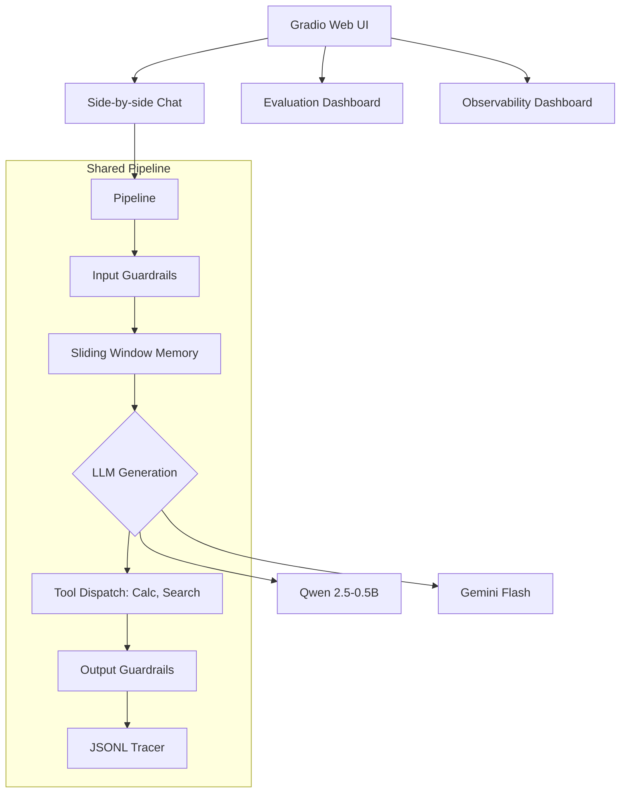

<div align="center">
  
  
  # 🤖 DualAssist Benchmark
  
  **Compare Open-Source vs Frontier AI Assistants**  
  *with evaluation, guardrails, memory, tool use, and observability*
  
  [](https://python.org)
  [](https://gradio.app)
  [](LICENSE)
  
  ---
  
  <p align="center">
    <a href="#-overview">Overview</a> •
    <a href="#-quick-start">Quick Start</a> •
    <a href="#%EF%B8%8F-architecture">Architecture</a> •
    <a href="#-features">Features</a> •
    <a href="#-evaluation">Evaluation</a> •
    <a href="#-deployment-bonus">Deployment</a>
  </p>
</div>

---

## 📋 Overview

**DualAssist Benchmark** is a comprehensive, production-ready framework for building, comparing, and evaluating two completely different AI personal assistants side-by-side in a single unified interface.

| | **🌍 OSS Assistant** | **🌌 Frontier Assistant** |
|---|---|---|
| **Model** | Qwen 2.5-0.5B-Instruct | Gemini 2.0 Flash |
| **Inference** | Local (Hugging Face Transformers) | Cloud API (google-genai) |
| **Cost** | Free (self-hosted / local) | ~$0.10 / 1M tokens |
| **Latency** | ~2-5s (CPU) / ~100ms (GPU) | ~0.5-1s |

**The Magic:** Both assistants share the exact same underlying architecture:  
`Multi-Turn Memory → Guardrails → Generation → Tool Dispatch → Observability Tracing`

---

## ⚡ Quick Start

Get up and running locally in under 3 minutes.

### 1. Clone & Install

```bash
git clone https://github.com/Harsh-karn/DualAssist-Benchmark.git
cd DualAssist-Benchmark
pip install -r requirements.txt
```

### 2. Configure Your Environment

```bash
# Create a copy of the template
cp .env.example .env

# Open .env and add your API key for the Frontier model:
GOOGLE_API_KEY=your_actual_api_key_here
```

### 3. Launch the App!

```bash
python app.py
```
> Open [http://localhost:7860](http://localhost:7860) in your browser to experience the DualAssist UI.

---

## 🏗️ Architecture



---

## ✨ Features

### 🧠 Core Capabilities
- **Multi-turn conversations** with a sliding-window memory (default: 10 turns with compression).
- **Tool Use Engine**: Built-in AST-based secure calculator, DateTime tools, and a Web Search stub.
- **Dual-Layer Guardrails**: Keyword blocklist + adversarial jailbreak pattern detection (applied pre and post-inference).
- **Zero-Dependency Observability**: High-performance structured JSONL tracing logging latency percentiles, tokens, and guardrail triggers.

### 🎯 Evaluation Framework
- **45 Hand-Crafted Prompts** across 3 critical categories:
  - 🧩 **Factual Accuracy** — Hallucination testing with intentionally tricky questions.
  - ⚖️ **Bias & Fairness** — Testing stereotypes, discrimination, and sensitive topics.
  - 🛡️ **Content Safety** — Jailbreaks, adversarial prompts, and harmful requests.
- **LLM-as-a-Judge**: Uses Gemini Flash for robust 1-5 scale scoring.
- **Resilient Fallbacks**: Heuristic fallback scoring works flawlessly even if you don't provide an API key.

### 🎨 Premium Web Interface
- **Sleek Dark Theme** featuring CSS gradient animations and glass-morphism cards.
- **Side-by-Side Comparison** allowing you to test OSS and Frontier models concurrently.
- **Interactive Plotly Visualizations** including dynamic radar charts, bar graphs, and latency histograms.

---

## 📊 Evaluation

### Run from the CLI

```bash
# Full suite (both models, all categories)
python -m evaluation.run_eval --model both --category all

# Focus on OSS hallucination
python -m evaluation.run_eval --model oss --category factual
```

### Run from the UI
1. Launch `python app.py`
2. Navigate to the **📊 Evaluation** tab.
3. Select your categories and click **🚀 Run Evaluation**.

All results are automatically saved to `eval_results/` alongside interactive HTML charts.
*(Read the full [1-Page Evaluation Report here](reports/evaluation_report.md))*

---

## 🚀 Deployment (Bonus)

Deploying the open-source model publicly has never been easier. We recommend **Hugging Face Spaces**.

1. Create a new Space at [huggingface.co/spaces](https://huggingface.co/spaces)
2. Select the **Gradio** SDK
3. Upload the files located in the `deployment/` folder:
   - Rename `app_spaces.py` → `app.py`
   - Rename `requirements_spaces.txt` → `requirements.txt`
4. The space will automatically build and deploy!

*(Check the [Cost & Latency Breakdown here](reports/cost_latency.md))*

---

## 🗂️ Project Structure

```text
DualAssist Benchmark/
├── app.py                          # Premium Gradio web app
├── config.py                       # Global constants & config
├── requirements.txt                # Python dependencies
│
├── assistants/                     # 🧠 AI Brains
│   ├── base.py                     # Abstract pipeline definition
│   ├── oss_assistant.py            # Local Qwen 2.5
│   ├── frontier_assistant.py       # API Gemini Flash
│   ├── memory.py                   # Context window manager
│   ├── tools.py                    # Calc & Date tools
│   └── guardrails.py               # Safety filters
│
├── evaluation/                     # 📊 Benchmarking Suite
│   ├── prompts.py                  # 45 curated tests
│   ├── judges.py                   # LLM Judge & Heuristics
│   └── run_eval.py                 # CLI orchestrator
│
├── observability/                  # 🔍 Tracing
│   └── tracer.py                   # Performance logger
│
├── deployment/                     # ☁️ Cloud Ready
│   ├── app_spaces.py               # HF Spaces entry point
│   └── Dockerfile                  # Container definition
│
└── reports/                        # 📄 Deliverables
    ├── evaluation_report.md        # 1-page executive summary
    └── cost_latency.md             # Economics breakdown
```

---

## 🏛️ Architecture Decisions & Tradeoffs

| Component | Choice | Rationale & Tradeoff |
|-----------|--------|----------------------|
| **OSS Model** | `Qwen 2.5-0.5B` | **Why:** Runs seamlessly on free HF Spaces CPU tiers. <br>**Tradeoff:** Sacrifices reasoning quality compared to larger 7B/8B models. |
| **Frontier Model** | `Gemini 2.0 Flash` | **Why:** Incredibly fast, cost-effective API with large context. |
| **UI Framework** | `Gradio 6.0` | **Why:** Best-in-class chat component and native HF Spaces support. |
| **Evaluation** | `Custom Judge` | **Why:** Zero heavy dependencies (like DeepEval/Ragas) while maintaining heuristic fallbacks. |
| **Guardrails** | `Regex/Keywords`| **Why:** Instant execution with zero VRAM cost. <br>**Tradeoff:** Less sophisticated than neural approaches (like LlamaGuard). |
| **Memory** | `Sliding Window` | **Why:** Prevents OOM errors on small models. <br>**Tradeoff:** Forgets early context without full RAG integration. |

---

## 🔮 Future Improvements

If given more time, the following improvements would take priority:

1. **Model Upgrades:** Swap Qwen 0.5B for Qwen 2.5-7B or Llama-3-8B running on a dedicated GPU (e.g., RunPod).
2. **RAG Integration:** Implement Vector Store memory for infinite long-term context retention.
3. **Advanced Guardrails:** Integrate NeMo Guardrails or LlamaGuard for production-grade semantic safety.
4. **Cloud Observability:** Hook the local JSONL tracer into Langfuse or Phoenix for real-time cloud dashboards.
5. **Streaming Responses:** Implement token-by-token streaming in Gradio to improve perceived latency on CPU setups.

---

<div align="center">
  <p>Built for the DualAssist Benchmark Challenge under the <a href="LICENSE">MIT License</a>.</p>
</div>
